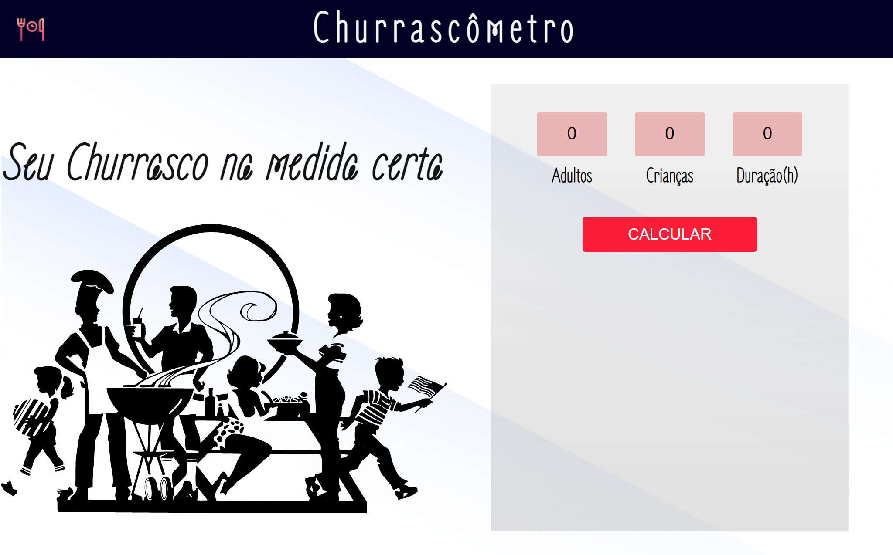
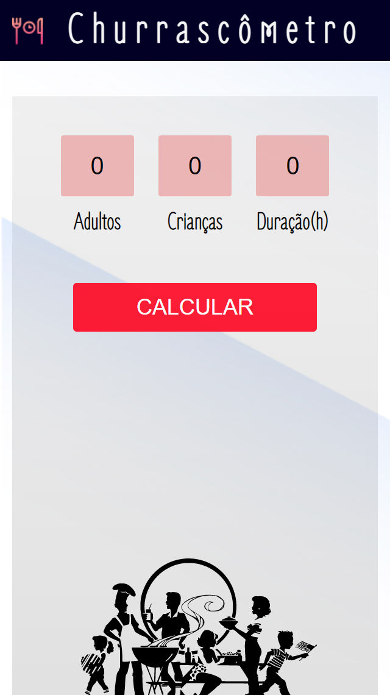
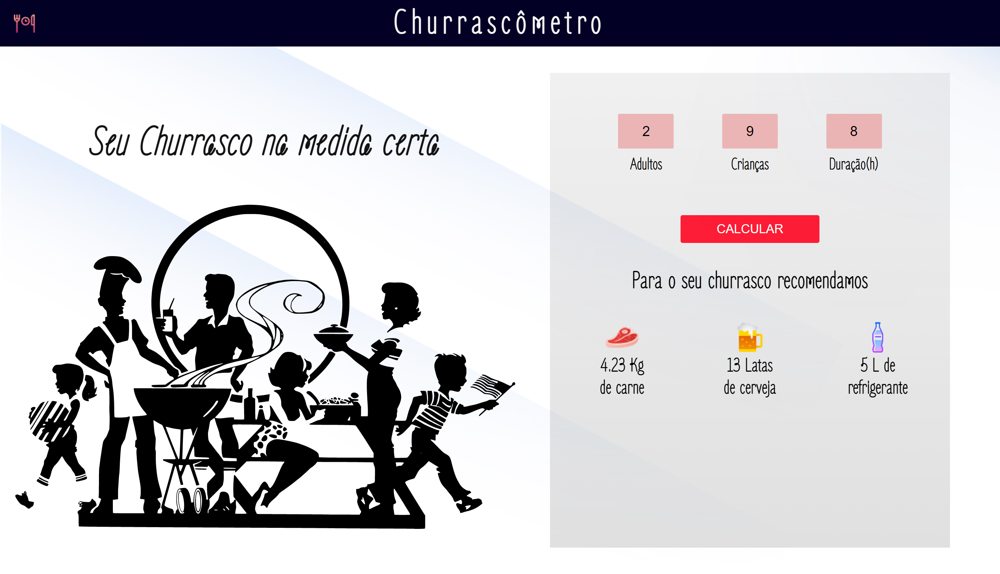
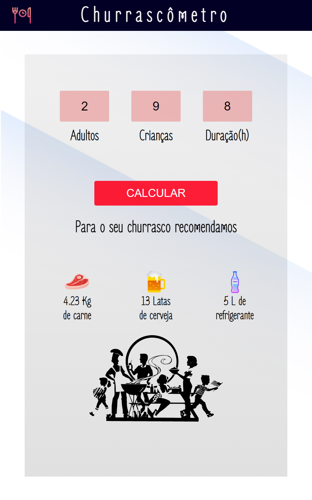

<h1>Churrascômetro</h1>
  

 Currascômetro é uma aplicação, que consiste em calcular a quantidade aproximada de carne e bebidas em relação a quantidade de adultos, crianças e horas de duração.
 

 

   

   

  
 

 Projeto desenvolvido com o objetivo de por em prática os conhecimentos em HTML, CSS E JavaScript.

